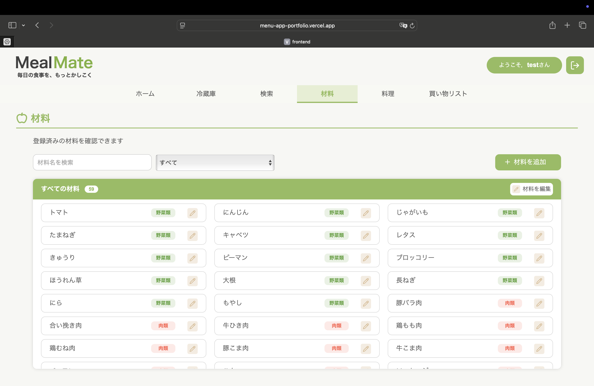
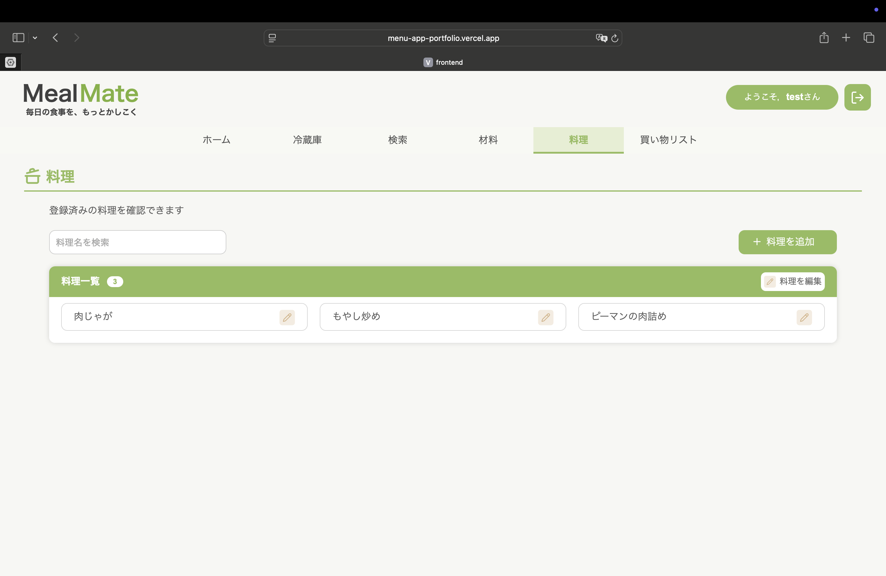
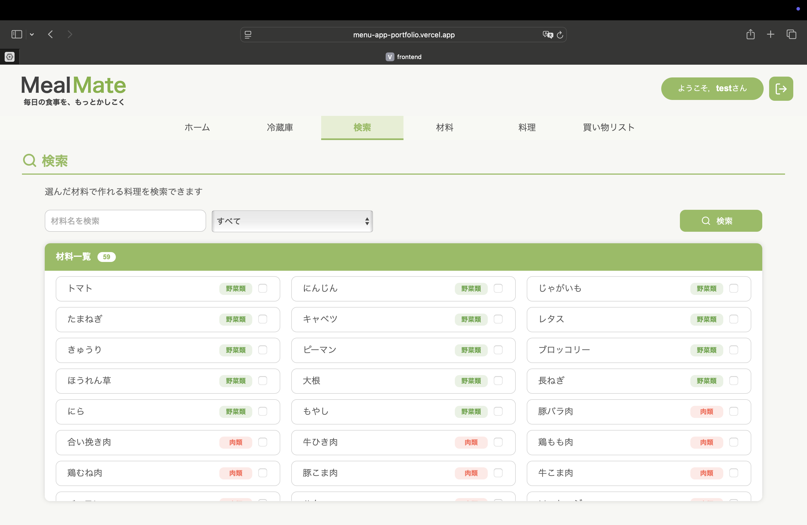
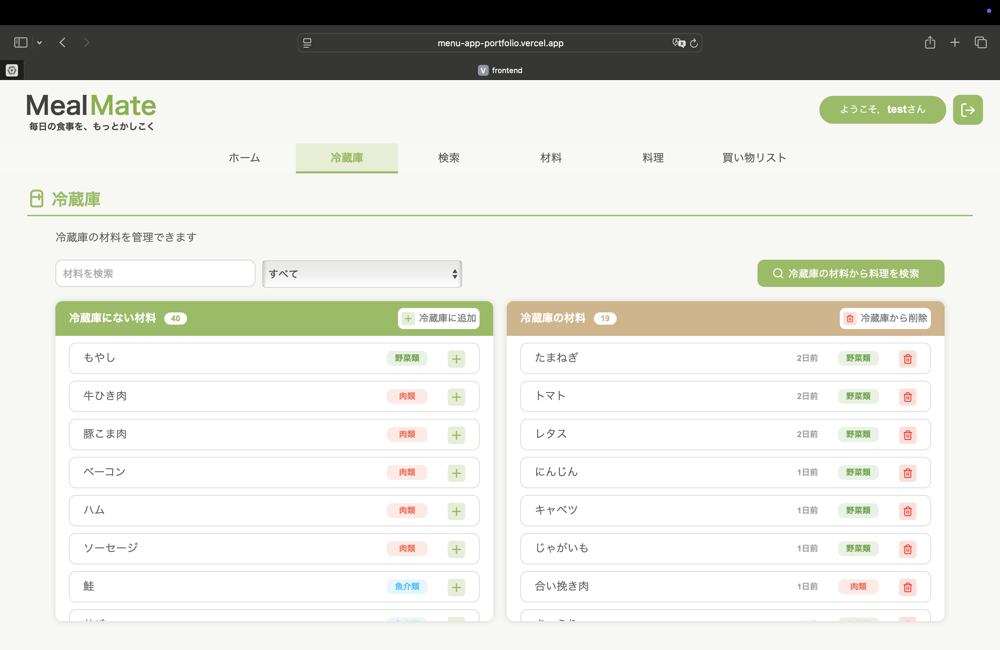
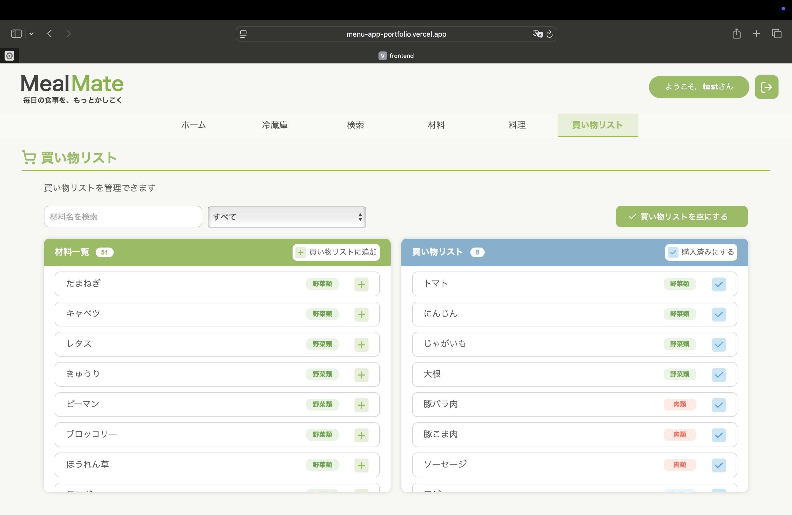

# Meal Mate

一人暮らしの方向けに，毎日の献立を考える手間を減らすWebアプリを開発しました．

私自身も一人暮らしをしており，「今日は何を作ろうか」と毎日献立を考えることを面倒に感じていました．
また，冷蔵庫の材料を使い切れず，食材を余らせてしまうことも多くありました．

そこで，手元にある材料から作れる料理を簡単に検索できるアプリを作ろうと考え，本アプリを開発しました．
ユーザーは冷蔵庫内の材料を登録することで，その材料で作れる料理を検索でき，不足している材料も確認できます．

## アプリURL

https://menu-app-portfolio.vercel.app

## 技術構成

- Frontend: React + TypeScript + Vite
- Backend: Python + Flask + SQLAlchemy
- Database: PostgreSQL
- Deploy:
  - Frontend: Vercel
  - Backend: Render

## 主な機能

- ユーザー認証
- 冷蔵庫による材料の管理
- 買い物リスト
- 献立提案
- 手持ちの材料で作れる料理の提案
- 不足材料の表示

## 主な画面

- ホーム

<table>
<tr>
<th>PC</th>
<th>スマホ</th>
</tr>
<tr>
<td></td>
<td></td>
</tr>
</table>

- 材料一覧

<table>
<tr>
<th>PC</th>
<th>スマホ</th>
</tr>
<tr>
<td></td>
<td></td>
</tr>
</table>

- 料理一覧

<table>
<tr>
<th>PC</th>
<th>スマホ</th>
</tr>
<tr>
<td></td>
<td></td>
</tr>
</table>

- 検索

<table>
<tr>
<th>PC</th>
<th>スマホ</th>
</tr>
<tr>
<td></td>
<td></td>
</tr>
</table>

- 冷蔵庫

<table>
<tr>
<th>PC</th>
<th>スマホ</th>
</tr>
<tr>
<td></td>
<td></td>
</tr>
</table>

- 買い物リスト

<table>
<tr>
<th>PC</th>
<th>スマホ</th>
</tr>
<tr>
<td></td>
<td></td>
</tr>
</table>

## 今後追加予定の機能

- 料理画像表示
- AIによる献立提案

## 改善履歴

- スマホChromeのみログインできない問題
  - 原因:
    クロスサイトCookie制限
  - 解決:
    Vercel rewritesを利用し，same-origin 化

- スマホで hover が残留する問題
  - 解決:
    `@media (hover: hover)` を利用してPCのみにhover適用．
    スマホ版では`:active`を適用．

- ページ更新時に404になる問題
  - 原因:
    React RouterのルーティングをVercelが認識できていなかった
  - 解決:
    `vercel.json`にrewrite 設定を追加

- iPhoneでinputフォーカス時に画面がズームされる問題
  - 解決:
    inputのfont-sizeを16px以上に調整

