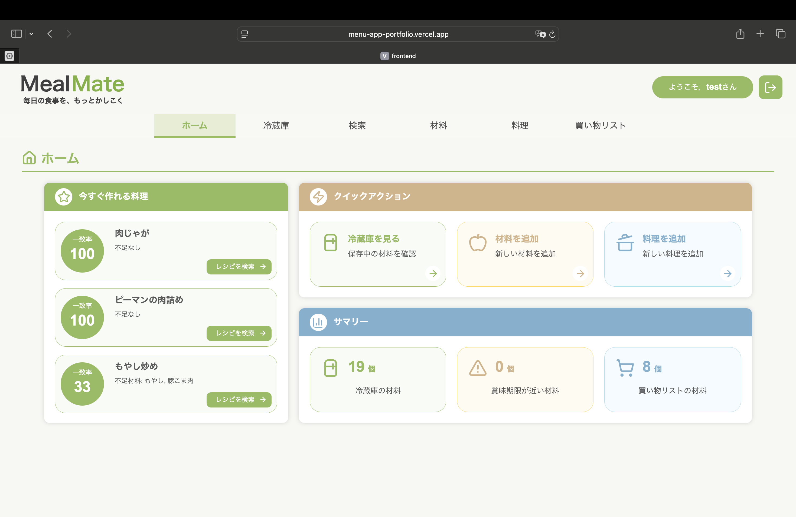
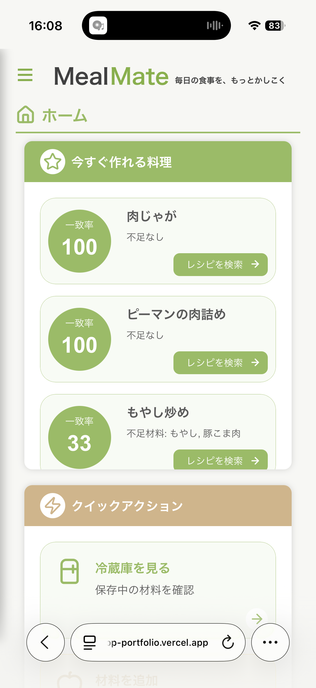
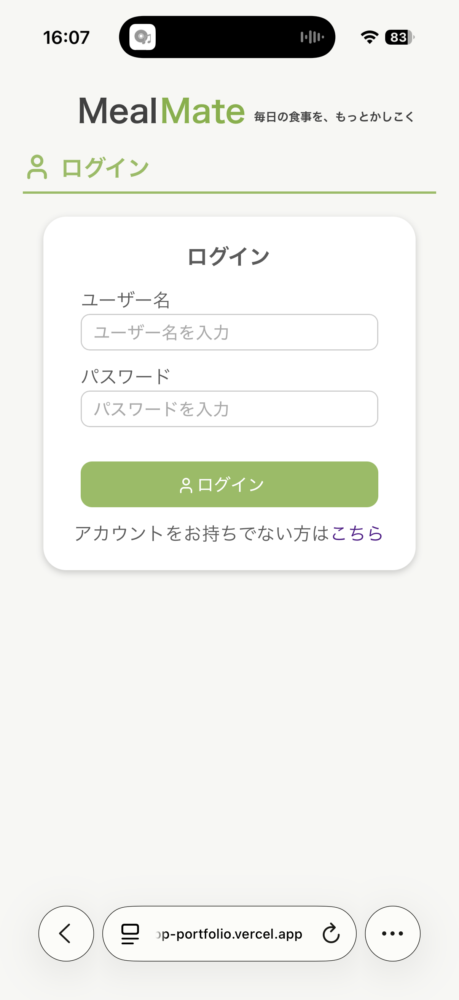
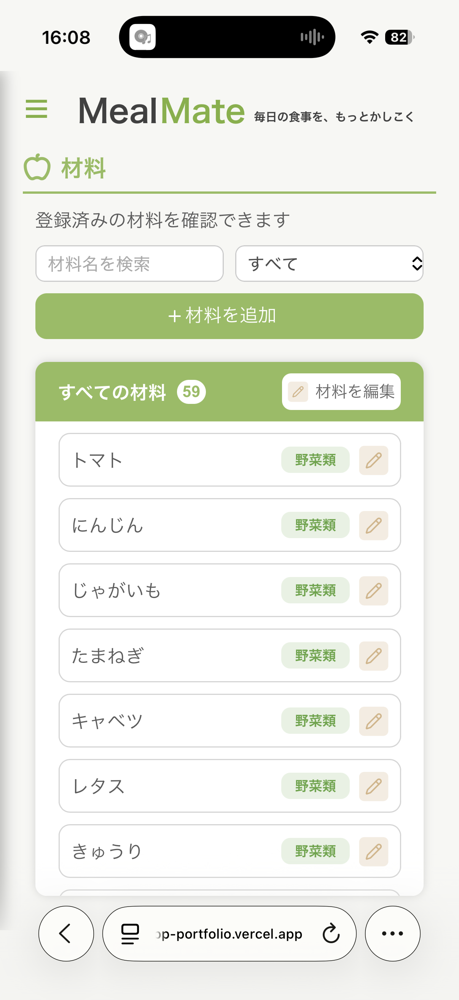
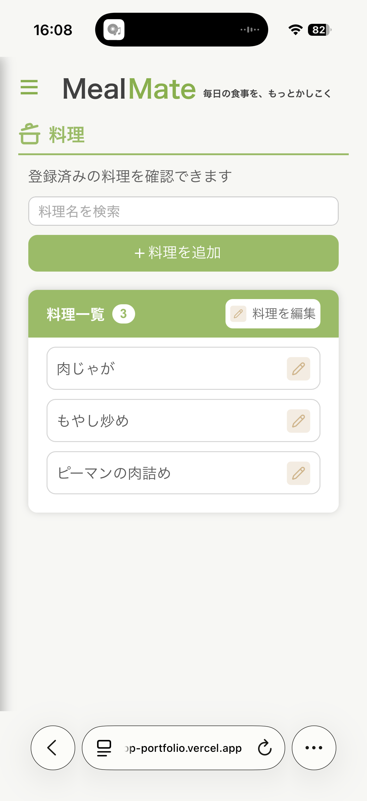
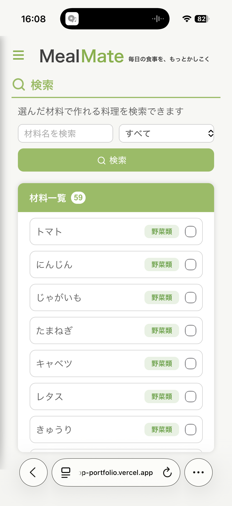
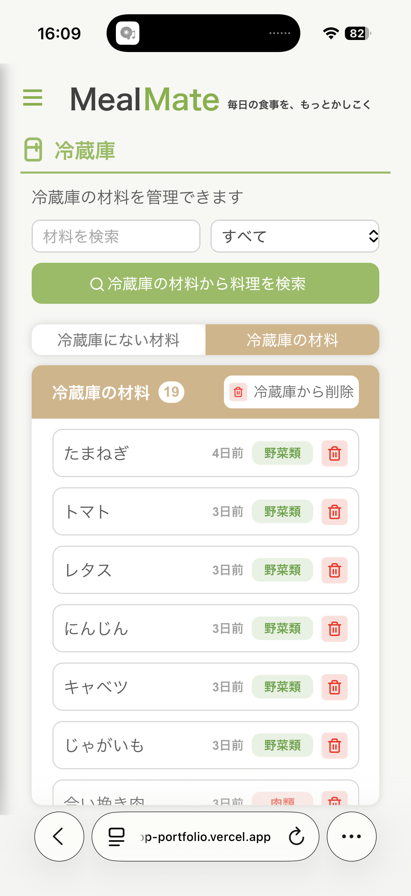
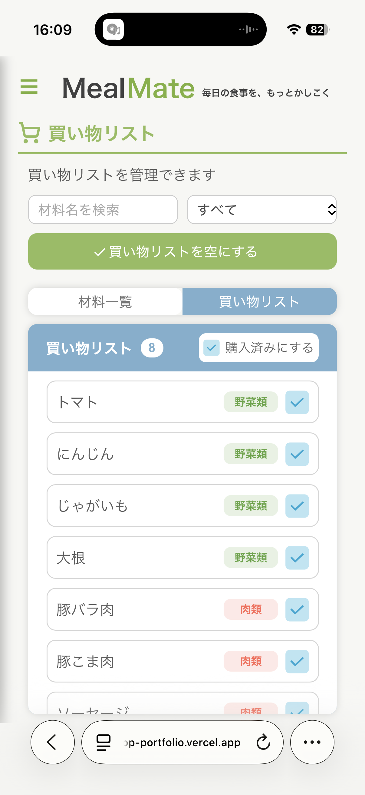

# Meal Mate

献立提案・冷蔵庫管理Webアプリ

## 技術構成

- Frontend: React + TypeScript + Vite
- Backend: Flask + SQLAlchemy
- Database: PostgreSQL
- Deploy:
  - Frontend: Vercel
  - Backend: Render

## 主な機能

- ユーザー認証
- 冷蔵庫管理
- 買い物リスト
- 献立提案
- 不足材料の表示

## ホーム画面
- PC
  - ホーム
    
    
  - 材料一覧

- スマホ

